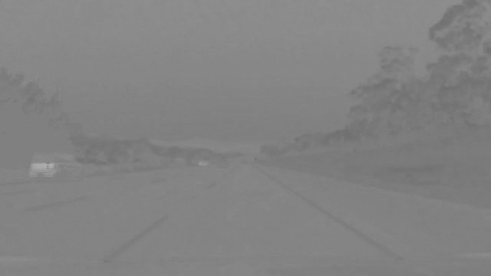

## Advanced Lane Finding
Author:  Aparajith Sridharan(s.aparajith@live.com)  
date: 26/12/2020

In this project, the goal is to write a software pipeline to identify the lane boundaries in a video. 
This README takes the reader through the steps used to develop this project.  

The Project
---

The goals / steps of this project are the following:

* Compute the camera calibration matrix and distortion coefficients given a set of chessboard images.
* Apply a distortion correction to raw images.
* Use color transforms, gradients, etc., to create a thresholded binary image.
* Apply a perspective transform to rectify binary image ("birds-eye view").
* Detect lane pixels and fit to find the lane boundary.
* Determine the curvature of the lane and vehicle position with respect to center.
* Warp the detected lane boundaries back onto the original image.
* Output visual display of the lane boundaries and numerical estimation of lane curvature and vehicle position.

The images for camera calibration are stored in the folder called `camera_cal`.  The images in `test_images` are for testing your pipeline on single frames.  If you want to extract more test images from the videos, you can simply use an image writing method like `cv2.imwrite()`, i.e., you can read the video in frame by frame as usual, and for frames you want to save for later you can write to an image file.  

# Code

The code was developed in an IDE and not in a jupytr notebook file due to the limitations on `cv2.imshow(...)`. Hence, the code will be found in a folder named `src`  

### Point 1 : Calibration
`Calibration.py` contains the methods used to calibrate the camera using the images in the folder `camera_cal`
 - `cal_dump()` method will be the main method used from this file. this uses the functions `cal_blind(...)` and `cal_mtx(...)` to evaluate the images in `camera_cal` folder and compute the camera matrix and the distortion coefficients. 
   Furthermore, the function will dump the matrix and distortion coefficient for later use in `calibration_data` folder.
 - running this file as a __main__ file will show one example of distortion correction as well as save the source and destination test image in the `calibration_data` folder.  

distorted image | undistorted image  
:-------------: | :---------------:  
 |  

### Point 2 : Color spaces, Gradients and Thresholding

`Transforms.py` contains the functions for transformation steps of the images.
 - For the images four types of color spaces were analyzed including the individual R G and B channels that was already covered in depth in the lectures.
   The three other channels are HSV , HLS, YUV*. YUV is the additional channel which was analyzed in addition to the lectures.
         
   YUV was interesting to experiment on because the color space of choice used in the analog television industry follows a unique way of transmitting luminance into Y (brightness) 
   U and V were made from the differences from B and R with Y signals respectively:
   
         Y = 0.299R + 0.587G + 0.114B
         U'= (B-Y)*0.565
         V'= (R-Y)*0.713
   ---
         YUV = cv2.cvtColor(img, cv2.COLOR_RGB2YUV)
         U = YUV[:, :, 1]
         binary = np.zeros_like(U)
         binary[(U > 10) & (U <= 127)] = 255

image used|U-channel | threshold on U-channel  
:-------------:|:-------------: | :---------------:  
| | 
| |  

As observed, the idea of using YUV color space alone was not particularly great as it worked well for White lines and also could identify Yellow lines but only differently which meant thresholding them would be challenging. 
Hence, Saturation in HLS was tried and...

image used|S-channel | threshold on S-channel  
:-------------:|:-------------: | :---------------:  
| | 
| | 

... it works well consistently with yellow or white lane lines and fairly well under noisy conditions .

#### Sensor fusion:
To improve the binary output a "sensor fusion" approach is taken where magnitude of sobel X and Y together is taken on the grayscale image, thresholded with a different threshold and added with the S-Channel binarized image. 
Thus, providing absent lane details in the S-channel farther away from the Ego vehicle as shown below:

S-channel|Sobel-xy magnitude | Fusioned output  
:-------------:|:-------------: | :---------------:  
| | 

### Point 3: Distortion correction and Perspective transform
The following steps were done:
- undistort the binarized image with the previously calculated camera matrix and distortion coefficients. 
- perform a perspective transform. Below illustration shows the output of a straight line lanes, turning lanes. 

Distortion corrected image  (with ROI for illustration) | Perspective transform  
:-------------:|:-------------:   
|
|

### Point 4: Lane scanning using windowing method and Polynomial fitting
the file `Polyfit.py` contains all definitions to successfully try and fit a polynomial. the pipeline that automates this is 
defined in `finalPipeline(...)`
The steps that are carried after perspective transform is to calculate curvature using two methods.
- first for an initial run to find the lane lines, a polynomial fitting is done by using teh histogram and scanning the likelihood of lanes in the histogram
  this is implemented in the function `find_lane_pixels(...)`  
- to improve on performance, the initially found left and right lane polynomial coefficients would be used as a ballpark to find successive lanes when a video is run frame by frame to detect lanes.
  this is implemented in the function `search_around_poly(...)` and `fitPolynomialWithPerformance(...)` helps in choosing the two algorithms
  
input image | perspective transformed image    
:-------------:|:-------------:
|

polynomial fitting using sliding window| Polynomial fitting using fast scanning with known polynomial  
:-------------:|:-------------:
|

- the pipeline is developed in a way so that the scaling of the radius of curvature is done on the polynomial equation  

      x = A(y^2) + By + C 

- substituting for Xr = (1/M_x)*Xpixels and Yr = (1/M_y )*Ypixels  

   
      Xr = (M_x/(M_y^2))*A*Yr + (M_x/M_y)*B*Yr + C  
where, M_x and M_y are meters per pixels scaling factors and Xr, Yr are the real world X and Y coordinates. 

- the function `measureCurvatureWorld(...)` will help in transforming the left and right lane lines into real world coordinates approximately so that some results can be inferred

- the factors M_x is taken to be as 3.7 / 910 as final from polynomial fitting, the lanes in x direction is around 910 px apart after fine tuning
    M_y is retained at 30 / 720 as it is 720 px long.
- with this setup, curve radius of 629.55 m and 515.85 m were computed. It is obvious from the image as the curve on the right is sharper than on the left. So, the right hand curve has a much smaller radius.     

### Point 5: Putting it all together to optimize between performance and correctness
the polyfit pipeline function `finalPipeline(...)` contains a key variable called `fitmiss`. 
This variable is set to true when the solution to polynomial fitting fails or the `search_around_poly(...)` function fails to draw a proper left and right lane line based on its distance of separation.
thus, this will trigger a cascade response that will clear the filter containing the filtered polynomial coefficients and toggle `once` to degrade performance in order to accurately re-calculate the lane lines.

- Line class
      
      class Line():
       def __init__(self):
           # was the line detected in the last iteration?
           self.detected = False
           # average x values of the fitted line over the last n iterations
           self.bestx = None
           # polynomial coefficients averaged over the last n iterations
           self.best_fit = None
           # polynomial coefficients for the most recent fit
           self.current_fit = np.array([0,0,0],dtype=np.float)
           # polynomial coefficients stored for N cycles
           self.running_fit = []
           # radius of curvature of the line in [m]
           self.radius_of_curvature = None
           # difference in fit coefficients between last and new fits
           self.diffs = np.array([0,0,0], dtype='float')
           # Max cycles for smoothing filter
           self.Max_N = 20
   
       def smooth(self):
           if len(self.running_fit) > 0:
               self.best_fit = np.mean(self.running_fit, axis=0)
            
       def add(self, new_fit):
           self.current_fit = new_fit
           if len(self.running_fit) == self.Max_N:
               # remove first element
               self.running_fit.pop(0)
           # append new element
           self.running_fit.append(new_fit)
           self.smooth()
   
       def resetFilter(self):
           self.running_fit = []
   
       def calcPoly(self,ploty):
           self.bestx = self.best_fit[0] * ploty ** 2 + self.best_fit[1] * ploty + self.best_fit[2]

this class integrates the smoothing as well as holding of information necessary to draw the detected lanes on the 
output image as well as displaying curvature, position of the vehicle etc. 

### Point 6: run, read and save the Motion picture
Using the video(s) supplied the project will use opencv methods to read frame by frame and write back into media prefixed with `output_`
the respective functions are defined in `MotionPicture.py` using the object of class `LaneFinder` from `LaneDetector.py`.

### Point 7: calculation of Ego y-position using polynomial coefficients.   
it is quite easy to compute the Ego position with an assumption that the camera is mounted on the middle of the lane lines when the vehicle lies at the center.  
refer to the following picture:

The difference between the Lx and Rx to the mid point of the width of the image will tell which of these have a larger number of pixels length.
if midpointX-Lx is greater than Rx-midpointX then it means the camera has moved to the right and vide-versa. if it is zero then it is bang in the center of the lane.  

Using this information, the position of the Ego vehicle in meters can be approximately computed with the same scaling formula used before.

### Drawbacks and Additional methods used to make this work for the challenge videos

The challenge videos are harder mainly because of the following reasons:
- uneven road surface material on the right and the left halves. (color spaces, sobel operations and so on will not yeild results if the image has poor brightness and contrast)
- varying brightness and poor contrast at certain frames owing to shadows and vision bleaching(going under bridges). 
- erratic road curvatures

#### Auto Contrasting 
to try and tackle the points, the image was put through auto contrasting with the help of CLAHE.  
CLAHE stands for Contrast limited Adaptive Histogram equalization. each pixel is transformed based on the histogram of the surrounding pixels and works quite well for poorly contrasted images.  
this is implemented in the `clahe(...)` function in `Transforms.py`

#### Auto alpha and beta calculations for brightness
to make sure the image has decent illumination, the auto brightness algorithm that will spread the histogram and clip it effectively increasing the uniform brightness of the image.
after this the HLS color space was observed to produce better results in the S channel. 

`autobrcrt(...)` implements the auto brightness algorithm. and here is an example result   